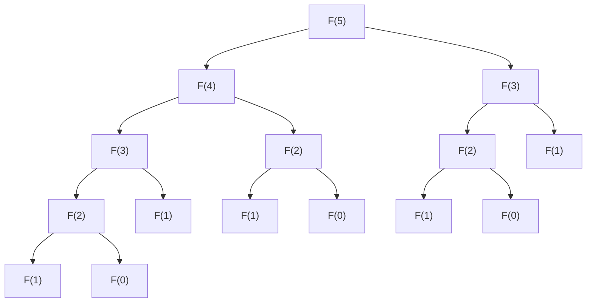

# 🌳 Formato del Árbol Recursivo (Mermaid)

## Descripción

El frontend ahora utiliza **Mermaid** para renderizar árboles de recursión. El backend debe enviar el diagrama en formato de código Mermaid dentro de la respuesta de análisis.

## Formato del Backend

### Estructura de la Respuesta

```json
{
  "solution": {
    "method": "Teorema Maestro (Forma General)",
    "steps": [
      {
        "step": "Paso 1: Identificar la relación de recurrencia",
        "explanation": "La función Fibonacci hace dos llamadas recursivas...",
        "formula": "T(n) = T(n-1) + T(n-2) + O(1)"
      },
      {
        "step": "Paso 2: Analizar el árbol de recursión",
        "explanation": "Cada llamada genera dos subproblemas...",
        "formula": "Altura = n, Nodos por nivel ≈ 2^i"
      },
      {
        "step": "Paso 3: Sumar el trabajo en todos los niveles",
        "explanation": "El trabajo en cada nivel i es O(2^i)...",
        "formula": "T(n) = Sum(2**i, i=0, n) = O(2**n)"
      },
      {
        "step": "Paso 4: Conclusión",
        "explanation": "La complejidad temporal es exponencial...",
        "formula": "T(n) = O(2**n)"
      }
    ],
    "recurrence": {
      "original": "T(n) = T(n-1) + T(n-2) + O(1)",
      "base_cases": ["T(0) = O(1)", "T(1) = O(1)"],
      "explanation": "La función realiza dos llamadas recursivas..."
    },
    "exact": {
      "best": "n",
      "avg": "2**n",
      "worst": "2**n"
    },
    "bounds": {
      "omega": "2**(n/2)",
      "theta": "2**n",
      "big_o": "2**n"
    },
    "recursive_tree": {
      "n_value": 5,
      "mermaid": "graph TD\n    n5_1[\"F(5)\"]\n    n4_1[\"F(4)\"]\n    ...",
      "total_calls": 15
    }
  },
  "type": "recursivo"
}
```

## Formato del Código Mermaid

### Ejemplo para Fibonacci(5)



### String para el Backend

```json
{
  "mermaid": "graph TD\n    n5_1[\"F(5)\"]\n    n4_1[\"F(4)\"]\n    n3_1[\"F(3)\"]\n    n2_1[\"F(2)\"]\n    n1_1[\"F(1)\"]\n    n0_1[\"F(0)\"]\n    n1_2[\"F(1)\"]\n    n2_2[\"F(2)\"]\n    n1_3[\"F(1)\"]\n    n0_2[\"F(0)\"]\n    n3_2[\"F(3)\"]\n    n2_3[\"F(2)\"]\n    n1_4[\"F(1)\"]\n    n0_3[\"F(0)\"]\n    n1_5[\"F(1)\"]\n\n    n5_1 --> n4_1\n    n5_1 --> n3_2\n    n4_1 --> n3_1\n    n4_1 --> n2_2\n    n3_1 --> n2_1\n    n3_1 --> n1_2\n    n2_1 --> n1_1\n    n2_1 --> n0_1\n    n2_2 --> n1_3\n    n2_2 --> n0_2\n    n3_2 --> n2_3\n    n3_2 --> n1_5\n    n2_3 --> n1_4\n    n2_3 --> n0_3"
}
```

## Reglas de Generación

### 1. Identificadores Únicos

Cada nodo debe tener un ID único en formato: `n{valor}_{contador}`

Ejemplos:
- `n5_1` - Primera vez que aparece F(5)
- `n4_1` - Primera vez que aparece F(4)
- `n1_2` - Segunda vez que aparece F(1)

### 2. Sintaxis de Nodos

```
nodeId["F(valor)"]
```

Ejemplos:
- `n5_1["F(5)"]`
- `n3_2["F(3)"]`
- `n0_1["F(0)"]`

### 3. Sintaxis de Conexiones

```
nodoParent --> nodoHijo
```

Ejemplos:
- `n5_1 --> n4_1` (F(5) llama a F(4))
- `n5_1 --> n3_2` (F(5) llama a F(3))

### 4. Estructura General

```
graph TD
    [declaración de nodos]
    [línea vacía]
    [declaración de conexiones]
```

## Campos Requeridos

### `steps` (array de objetos) - NUEVO

Pasos detallados de cómo se resolvió la complejidad:

| Campo | Tipo | Descripción |
|-------|------|-------------|
| `step` | string | Título del paso (ej: "Paso 1: Identificar la relación") |
| `explanation` | string | Explicación detallada del paso |
| `formula` | string | Fórmula matemática asociada al paso (soporta notación: **, Sum(), ^, etc.) |

**Importante**: Las fórmulas soportan:
- Potencias: `2**n` se renderiza como 2^n
- Sumatorias: `Sum(2**i, i=0, n)` se renderiza como ∑
- Operaciones: `*` se convierte en ·

### `recursive_tree` (objeto)

| Campo | Tipo | Descripción |
|-------|------|-------------|
| `n_value` | number | El valor de n usado para generar el árbol |
| `mermaid` | string | Código Mermaid del árbol completo |
| `total_calls` | number | Total de llamadas recursivas realizadas |

## Ejemplos por Algoritmo

### Factorial(4)

```json
{
  "recursive_tree": {
    "n_value": 4,
    "mermaid": "graph TD\n    n4_1[\"factorial(4)\"]\n    n3_1[\"factorial(3)\"]\n    n2_1[\"factorial(2)\"]\n    n1_1[\"factorial(1)\"]\n    n0_1[\"factorial(0)\"]\n\n    n4_1 --> n3_1\n    n3_1 --> n2_1\n    n2_1 --> n1_1\n    n1_1 --> n0_1",
    "total_calls": 5
  }
}
```

### Búsqueda Binaria (array de 8 elementos)

```json
{
  "recursive_tree": {
    "n_value": 8,
    "mermaid": "graph TD\n    n8_1[\"buscar(0,7)\"]\n    n4_1[\"buscar(0,3)\"]\n    n2_1[\"buscar(0,1)\"]\n    n1_1[\"buscar(0,0)\"]\n\n    n8_1 --> n4_1\n    n4_1 --> n2_1\n    n2_1 --> n1_1",
    "total_calls": 4
  }
}
```

### Torres de Hanoi(3)

```json
{
  "recursive_tree": {
    "n_value": 3,
    "mermaid": "graph TD\n    n3_1[\"hanoi(3)\"]\n    n2_1[\"hanoi(2)\"]\n    n1_1[\"hanoi(1)\"]\n    n1_2[\"hanoi(1)\"]\n    n2_2[\"hanoi(2)\"]\n    n1_3[\"hanoi(1)\"]\n    n1_4[\"hanoi(1)\"]\n\n    n3_1 --> n2_1\n    n3_1 --> n2_2\n    n2_1 --> n1_1\n    n2_1 --> n1_2\n    n2_2 --> n1_3\n    n2_2 --> n1_4",
    "total_calls": 7
  }
}
```

## Notas Importantes

1. **Escaping**: Los caracteres especiales en JSON deben estar escapados (`\n` para nuevas líneas)
2. **IDs únicos**: Cada nodo en el árbol debe tener un identificador único para evitar conflictos
3. **Orden**: Primero declarar todos los nodos, luego todas las conexiones
4. **Formato**: Usar `graph TD` (Top Down) para árboles que crecen hacia abajo
5. **Labels**: Usar corchetes con comillas: `["texto"]`

## Testing

Para probar que el formato está correcto, puedes usar:

1. **Mermaid Live Editor**: https://mermaid.live/
2. Pega tu código Mermaid y verifica que se renderiza correctamente

## Límites Recomendados

Por rendimiento y legibilidad:

- **n máximo**: 7 para Fibonacci (127 llamadas)
- **n máximo**: 5 para árbol binario completo
- **n máximo**: 4 para Torres de Hanoi (15 llamadas)

Si n > límite, considerar:
- Mostrar solo un subárbol representativo
- Comprimir ramas repetidas
- Usar indicadores visuales de continuación

---

**Última actualización**: Diciembre 2, 2025
